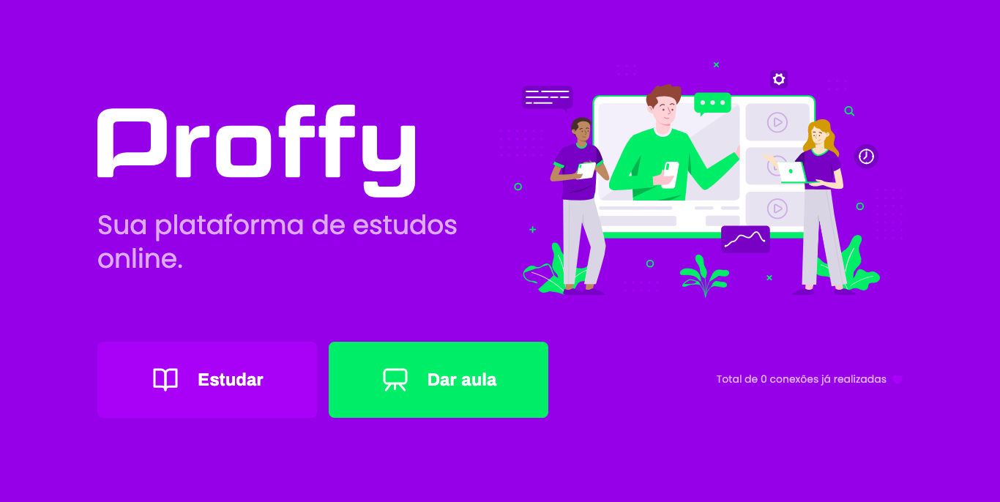

<div align="center">
  
  
</div>

## :computer: Projeto

Proffy - É uma aplicação voltada para conectar professores e alunos.  
Projeto realizado durante a segunda edição da NLW oferecido pela [@rocketseat](https://rocketseat.com.br/)

## :pushpin: Tecnologias

Esse projeto foi desenvolvido com as seguintes tecnologias:

- [React Native](https://reactnative.dev/)
- [TypeScript](https://www.typescriptlang.org/)
- [Expo](https://expo.io/)
- [Axios](https://github.com/axios/axios)
- [Knex](http://knexjs.org/)


## :point_down: Executando o projeto

No seu terminal copie e cole ou digite o comando abaixo:

```git
git clone https://github.com/jhonatasmatos/Proffy.git
````

Após realizar o clone acesse a pasta do projeto:

```git
cd Proffy
````  

Acesse o backend da nossa aplicação,
Logo em seguida digite o comando __*yarn*__ para baixar e atualizar as dependências do projeto

```git
cd server
````
```git
yarn
````

Agora inicie o servidor localmente com o comando:

```git
yarn start
````
Será iniciado nosso servidor no caminho _http://localhost:3333_

Agora temos acesso as rotas:

**/classes** - Rota responsável por criar uma aula e procurar por aulas
**/connections** - Rota responsável por gerar as conexões realizadas na plataforma, através do whatsapp

Com o backend no ar agora podemos iniciar nosso app ou nossa aplicação web

Web
```terminal
yarn start
````
App Mobile
```terminal
yarn start
````
_É necessário baixar o app "expo" na sua store (IOS/Android), ler o QRcode com seu celular com o app expo e **pronto**_


---
Feito com coração, café e muito esforço :heart: :rocket: